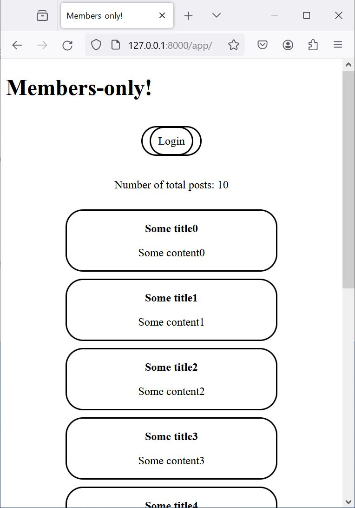
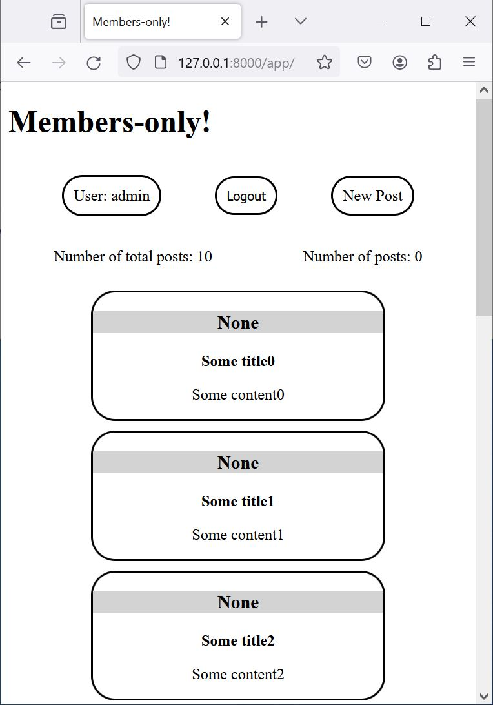
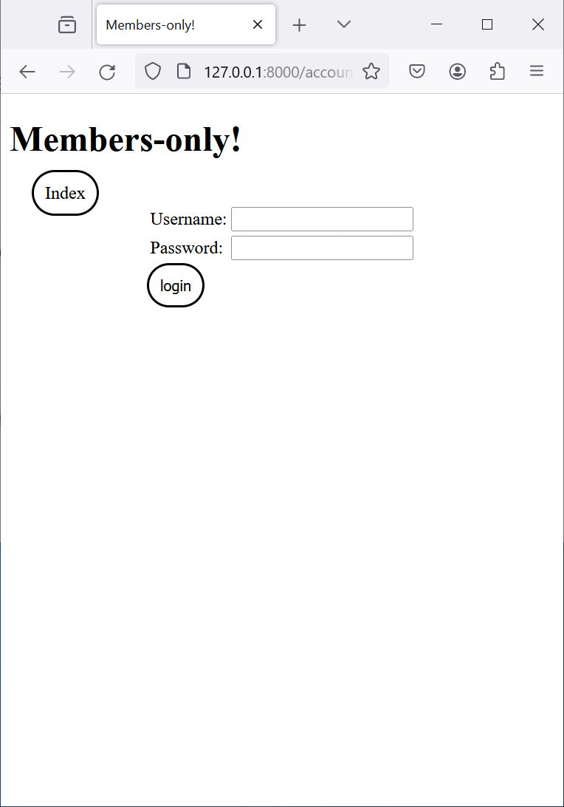
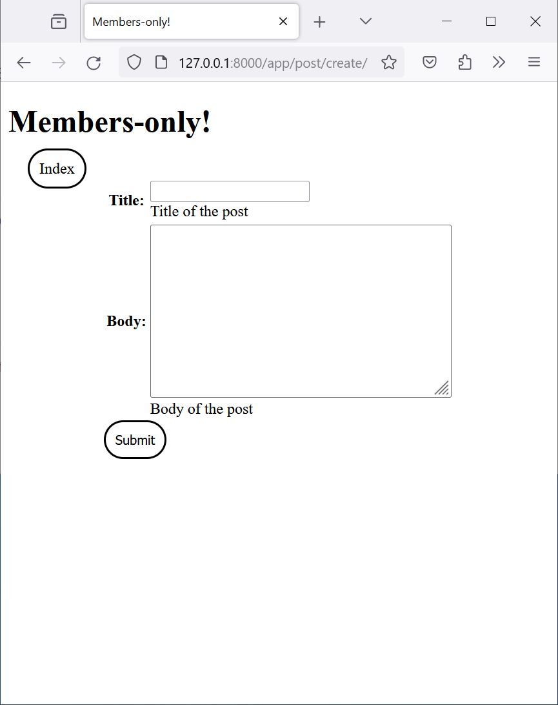

# Members-only

Small project building an exclusive clubhouse where members can write anonymous posts. Inside the clubhouse, members can see who the author of a post is but, outside, they can only see the story and wonder who wrote it.

# Python and used packages

- Python 3.10.6
- Django 5.0
- python-dotenv 1.0.0

# How to use

## 1. Clone the repository
    git clone
## 2. (optional) create a virtual environment

## 3. Install the dependencies from requirements.txt
    pip install -r requirements.txt
## 4. Apply migrations
    python manage.py migrate
## 5. Run server
     python manage.py runserver
## 6. Create user for login
    python manage.py createsuperuser
## 7. (optional) For seeding database with example data
    python manage.py seed
seed configuration for the seed command can be found at management/commands/seeds.py
## 8. (optional) For testing
    python manage.py test
Testing files can be found inside management/tests/

# Routes

```
/
├── admin/
├── accounts/
│     ├── login/
│     └── logout/
└── app/
      └── post/
           └── create/
```
# Pages
<details>
  <summary>Open</summary>
  
  ## 1. Index (logged out)
  

  ## 2. Index (logged in)
  

  ## 3. Login
  

  ## 4. New Post
  


</details>